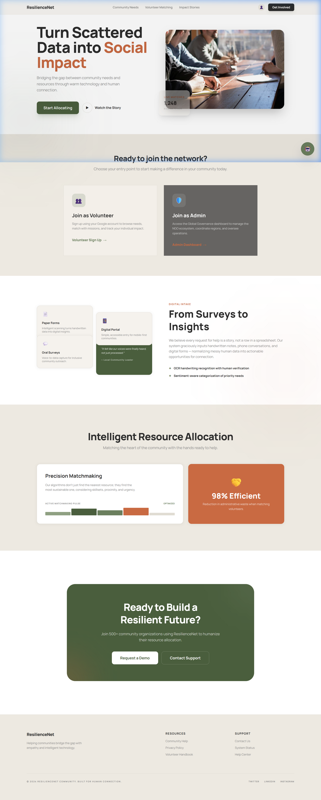
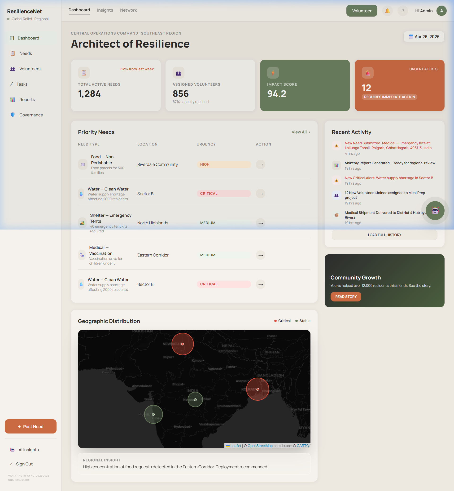
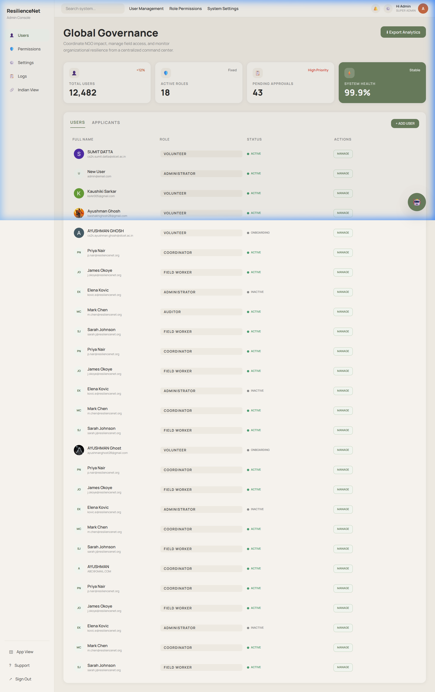
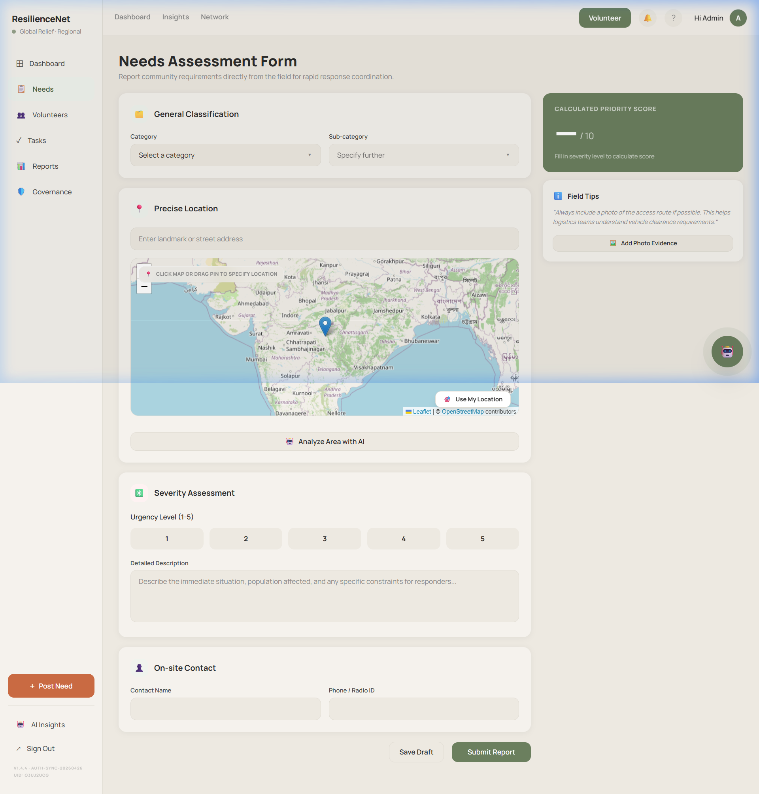

<div align="center">

  

  # 🌍 ResilienceNet
  ### Smart Venue Governance & Resource Allocation Platform

  [](https://reactjs.org/)
  [](https://vitejs.dev/)
  [](https://tailwindcss.com/)
  [](https://firebase.google.com/)
  [](LICENSE)

  **A modern, high-performance web application for intelligent disaster management, volunteer orchestration, and real-time governance.**

  [Features](#-key-features) • [Tech Stack](#-technology-stack) • [Getting Started](#-getting-started) • [Architecture](#-architecture) • [Contributing](#-contributing)

</div>

---

## 📋 Table of Contents

- [Overview](#-overview)
- [Key Features](#-key-features)
- [Technology Stack](#-technology-stack)
- [Architecture](#-architecture)
- [Getting Started](#-getting-started)
- [Project Structure](#-project-structure)
- [Security & Roles](#-security--roles)
- [Screenshots](#-screenshots)
- [Contributing](#-contributing)
- [License](#-license)

---

## 🎯 Overview

ResilienceNet is a cutting-edge crisis management platform that leverages AI, real-time data, and geographic tracking to streamline disaster response operations. Built for speed and accessibility, the system enables intelligent resource allocation, volunteer coordination, and data-driven governance.

### 🌟 Key Highlights

- **AI-Powered Analysis**: Leverages Groq's Llama-3.3-70b for real-time disaster risk assessment
- **Real-Time Coordination**: Firebase-powered instant notifications and updates
- **Geographic Intelligence**: Interactive maps with precise geolocation tracking
- **Smart Matching**: Algorithmic volunteer-to-task matching system
- **Modern UX**: Premium glassmorphism design with smooth animations

---

## 🚀 Key Features

### 🗺️ Intelligent Needs Assessment
- Interactive map centered on India for crisis reporting
- Browser Geolocation API integration for precise coordinates
- One-click location capture and crisis tagging
- Visual crisis density mapping

### 🤖 AI-Powered Area Analysis
- Integration with Groq's `llama-3.3-70b-versatile` model
- On-the-fly disaster preparedness reports
- Risk analysis for any selected region
- Predictive insights for resource planning

### 👥 Volunteer Network & Matchmaking
- **Authentic Google Sign-in**: Real profiles with dynamic profile image sync
- **Smart Scoring Algorithm**: Matches volunteers to missions based on:
  - Skills and expertise
  - Geographic proximity
  - Availability status
  - Historical performance
- Real-time volunteer tracking

### 🔔 Real-Time Notifications
- Direct messaging between admins and volunteers
- Firestore-powered real-time updates
- Notification bell with dropdown history
- Instant UI refreshes on new events

### 📊 Governance Console
- Central command dashboard for administrators
- Global statistics and analytics visualization
- Live field worker monitoring
- **Excel Export**: Download aggregated analytics as `.xlsx` files
- Performance metrics and KPIs

### ✨ Modern UI/UX
- Premium glassmorphism navigation
- Fully responsive design (mobile-first approach)
- Smooth micro-animations powered by Framer Motion
- Custom Tailwind color palette (Sage, Terra, Charcoal)
- Accessible design with WCAG compliance

---

## 🛠️ Technology Stack

### Frontend
| Technology | Version | Purpose |
|------------|---------|---------|
| **React.js** | 18.2.0 | UI Framework |
| **Vite** | 5.1.0 | Build Tool & Dev Server |
| **Tailwind CSS** | 3.4.1 | Styling Framework |
| **React Router** | 6.22.0 | Client-Side Routing |
| **Framer Motion** | Latest | Animation Library |
| **React Leaflet** | 4.2.1 | Map Integration |
| **React Hot Toast** | 2.4.1 | Notification System |

### Backend & Database
| Technology | Purpose |
|------------|---------|
| **Firebase Authentication** | Google OAuth Sign-in |
| **Firebase Firestore** | NoSQL Real-time Database |
| **Google Maps API** | Geolocation & Geocoding |

### AI Integration
| Service | Model | Use Case |
|---------|-------|----------|
| **Groq Cloud API** | llama-3.3-70b-versatile | Disaster Analysis & Risk Assessment |

### Utilities
| Package | Purpose |
|---------|---------|
| **xlsx** | Excel Export |
| **Google Generative AI** | AI Model Integration |

---

## 🏗️ Architecture

### System Architecture

```
┌─────────────────────────────────────────────────────────────┐
│                     Frontend (React)                        │
│  ┌──────────┐  ┌──────────┐  ┌──────────┐  ┌──────────┐     │
│  │  Pages   │  │Components│  │  Hooks   │  │ Context  │     │
│  └──────────┘  └──────────┘  └──────────┘  └──────────┘     │ 
└─────────────────────────────────────────────────────────────┘
                            │
                            ▼
┌─────────────────────────────────────────────────────────────┐
│                     External Services                       │
│  ┌────────────┐  ┌────────────┐  ┌────────────┐             │
│  │  Firebase  │  │   Groq     │  │ Google Maps│             │
│  │  (Auth+DB) │  │    AI      │  │    API     │             │
│  └────────────┘  └────────────┘  └────────────┘             │
└─────────────────────────────────────────────────────────────┘
```

### Data Flow

1. **User Authentication** → Firebase Auth (Google OAuth)
2. **Real-time Data** → Firestore Listeners
3. **AI Analysis** → Groq API → Display Results
4. **Geolocation** → Browser API → Google Maps
5. **Notifications** → Firestore → React Hot Toast

---

## ⚙️ Getting Started

### Prerequisites

Before you begin, ensure you have the following installed:

- **Node.js** (v16 or higher) - [Download here](https://nodejs.org/)
- **npm** or **yarn** package manager
- **Git** - [Download here](https://git-scm.com/)

### Required API Keys & Services

You'll need accounts for:

- [Firebase Project](https://console.firebase.google.com/) with:
  - Authentication (Google Sign-in enabled)
  - Firestore Database
- [Groq Cloud API Key](https://console.groq.com/)
- [Google Maps JavaScript API Key](https://developers.google.com/maps/documentation/javascript/get-api-key)

### Installation Steps

#### 1. Clone the Repository

```bash
git clone https://github.com/AYUSHMANGH/Smart-Resource-Allocation.git
cd Smart-Resource-Allocation
```

#### 2. Install Dependencies

```bash
npm install
```

#### 3. Environment Configuration

Create a `.env` file in the root directory and add your credentials:

```env
# Firebase Configuration
VITE_FIREBASE_API_KEY="your_firebase_api_key"
VITE_FIREBASE_AUTH_DOMAIN="your_project_id.firebaseapp.com"
VITE_FIREBASE_PROJECT_ID="your_project_id"
VITE_FIREBASE_STORAGE_BUCKET="your_project_id.appspot.com"
VITE_FIREBASE_MESSAGING_SENDER_ID="your_sender_id"
VITE_FIREBASE_APP_ID="your_firebase_app_id"

# Groq AI Configuration
VITE_GROQ_API_KEY="your_groq_api_key"

# Google Maps Configuration
VITE_GOOGLE_MAPS_API_KEY="your_google_maps_api_key"
```

#### 4. Run the Development Server

```bash
npm run dev
```

Open [http://localhost:5173](http://localhost:5173) in your browser to view the application.

#### 5. Build for Production

```bash
npm run build
npm run preview
```

---

## 📁 Project Structure

```
Smart-Resource-Allocation/
├── src/
│   ├── components/          # Reusable UI components
│   │   ├── auth/           # Authentication components
│   │   ├── chatbot/        # AI chatbot interface
│   │   ├── layout/         # Layout components (AppLayout, AdminLayout)
│   │   └── maps/           # Map components (WorldMap, NeedsMapPicker)
│   ├── context/            # React Context providers
│   │   └── AuthContext.jsx # Authentication context
│   ├── firebase/           # Firebase configuration
│   │   ├── auth.js         # Authentication functions
│   │   ├── config.js       # Firebase config
│   │   └── firestore.js    # Database operations
│   ├── hooks/              # Custom React hooks
│   │   └── useGemini.js    # AI integration hook
│   ├── pages/              # Page components
│   │   ├── Analytics.jsx   # Analytics dashboard
│   │   ├── Dashboard.jsx   # Main dashboard
│   │   ├── Governance.jsx  # Admin governance console
│   │   ├── Insights.jsx    # AI insights page
│   │   ├── Landing.jsx     # Landing page
│   │   ├── Login.jsx       # Login page
│   │   ├── NeedsAssessment.jsx # Crisis reporting
│   │   ├── Onboarding.jsx  # User onboarding
│   │   ├── PendingApproval.jsx # Approval queue
│   │   ├── Tasks.jsx       # Task management
│   │   └── Volunteers.jsx  # Volunteer management
│   ├── styles/             # Global styles
│   │   └── globals.css     # Tailwind + custom styles
│   ├── App.jsx             # Main app component with routing
│   └── main.jsx            # Application entry point
├── public/                 # Static assets
├── .env                    # Environment variables
├── .gitignore             # Git ignore rules
├── index.html             # HTML template
├── package.json           # Project dependencies
├── tailwind.config.js     # Tailwind configuration
├── vite.config.js         # Vite configuration
└── README.md              # This file
```

---

## 🔒 Security & Roles

### User Roles

| Role | Access Level | Permissions |
|------|--------------|-------------|
| **Volunteer** | Standard | • View assigned tasks<br>• Access volunteer network<br>• Receive notifications<br>• Update profile & availability |
| **Admin** | Elevated | • Full access to Governance Console<br>• Global map monitoring<br>• Task assignment & management<br>• Volunteer approval<br>• Export analytics to Excel<br>• Send broadcast notifications |

### Authentication Flow

1. **Volunteer Registration**: Google Sign-in → Auto-assigned Volunteer role
2. **Admin Access**: Pre-configured via `admin@email.com` → Admin role
3. **Session Management**: Firebase Auth with persistent sessions
4. **Route Protection**: React Router guards for protected routes

---

## 📸 Screenshots

### Landing Page


### Dashboard


### Governance Console


### Needs Assessment Map


---

## 🤝 Contributing

We welcome contributions! Here's how you can help:

### How to Contribute

1. **Fork the repository**
2. **Create a feature branch**
   ```bash
   git checkout -b feature/your-feature-name
   ```
3. **Make your changes**
4. **Commit your changes**
   ```bash
   git commit -m "Add some feature"
   ```
5. **Push to the branch**
   ```bash
   git push origin feature/your-feature-name
   ```
6. **Open a Pull Request**

### Development Guidelines

- Follow the existing code style and conventions
- Write meaningful commit messages
- Add comments for complex logic
- Test your changes thoroughly
- Update documentation as needed

### Code Style

- Use **ESLint** for linting
- Follow **Prettier** formatting rules
- Use **Tailwind CSS** for styling
- Write **functional components** with hooks

---

## 📝 License

This project is licensed under the MIT License - see the [LICENSE](LICENSE) file for details.

---

## 🙏 Acknowledgments

- **Firebase** for authentication and real-time database
- **Groq** for AI model integration
- **Google Maps** for mapping services
- **React Community** for amazing tools and libraries

---

## 📞 Support

For support, please open an issue in the GitHub repository or contact the maintainers.

---

<div align="center">

**Built with ❤️ for disaster management and community resilience**

[⬆ Back to Top](#-resiliencenet)

</div>
